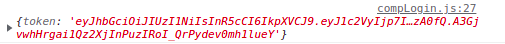

# Fullstack JWT dockerized 
el proyecto consiste en validar el acceso mediante el protocolo JWT. Tanto el front como el back se despliegan de manera automatica a traves de docker compose.


# Referencias
## Oficiales
- https://expressjs.com/
- https://es.reactjs.org/
- https://www.npmjs.com/package/nodemon
- https://www.npmjs.com/package/jsonwebtoken
- https://docs.docker.com/get-started/08_using_compose/
## No oficiales
- https://www.youtube.com/playlist?list=PL4cUxeGkcC9hxjeEtdHFNYMtCpjNBm3h7
- https://www.youtube.com/watch?v=6ZnecM3ipu4
- https://www.youtube.com/watch?v=cL3bXzUBFUA


# Desplegar
lo unico que se tiene que hacer es ejecutar los siguientes comandos
```bash
cd (ruta)/simple-fullstack-dockerized
docker-compose up -d
```
y listo. A continuacion una lista de otros comandos para explorar mas el proyecto:

-  visitar el front: http://localhost:3000/
- visitar el back: http://localhost:3001/
- crear imagen:
```
docker build -t nombre_que_le_quieres_poner_a_la_imagen .
```

en caso se quiera correr el backend y el frontend desde la linea de comando para editar el codigo usar los siguientes comandos
```bash
cd (ruta)/simple-fullstack-dockerized/backend
npx nodemon app.js

cd (ruta)/simple-fullstack-dockerized/frontend
npm start
```
